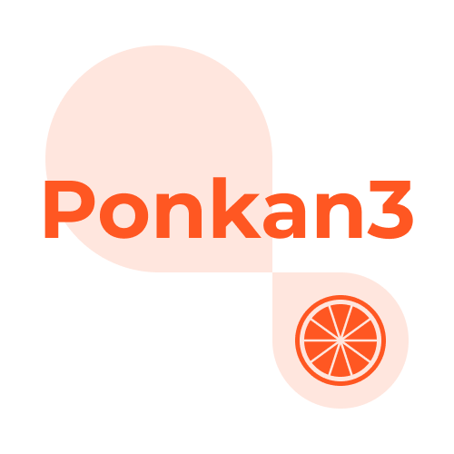

# Ponkan

<p align="center">
  
</p>

Ponkan はブラウザで動作するノベルゲームエンジンです。

Languages: [English](./README.en.md)

## デモ (サンプルゲーム)

[Ponkan サンプルゲーム](http://studiomikan.github.io/ponkan-samplegame)

## ドキュメント

[Ponkan ドキュメント](http://studiomikan.github.io/ponkan-docs)

## Build, Test

```bash
# 依存パッケージのインストール
$ npm install

# 開発向けに起動（開発用サーバー起動）
# 起動後に http://localhost:8080/ を開く
$ npm start

# テストをサーバーで起動
# 起動後に http://localhost:8080/dist_test/test.html を開く
$ npm run start-test

# テストをヘッドレスChromeで実行
# ※要Google Chrome
$ npm test

# リリースビルド（distディレクトリへ出力）
$ npm run build
```

## Docker

```bash
# Dockerfile needs an environment variable $CURRENT_UID like user_id:group_id .
# Does not work without $CURRENT_UID
# exsample: 1000:1000
$ export CURRENT_UID=$(id -u):$(id -g)

# build
$ docker-compose build

# Run develop server.
# Open http://localhost:8080/index.html
$ docker-compose up

# Run test server.
# Open http://localhost:8080/dist_test/test.html
$ WEBTEST=1 docker-compose up

# Launch container only. (do not start server.)
$ MANUAL=1 docker-compose up
```

## ブラウザサポート

- サポート中の対象ブラウザ
  - Google Chrome (最新)
- 今後サポート予定のブラウザ
  - Firefox (最新)
  - Edge (最新)

## Ponkan は以下のライブラリを使用しています

### Libraries

- [PixiJS](https://github.com/pixijs/pixi.js) is licensed under the [MIT License](https://opensource.org/licenses/MIT)
- [HOWLER.js](https://github.com/goldfire/howler.js) is licensed under the [MIT License](https://opensource.org/licenses/MIT)
- [Web Font Loader](https://github.com/typekit/webfontloader) is licensed under the [Apache License, Version 2.0](https://opensource.org/licenses/Apache-2.0)
  - Web Font Loader Copyright (c) 2010-2017 Adobe Systems Incorporated, Google Incorporated.

### Fonts

- [GenShinGothic](http://jikasei.me/font/genshin/) is licensed under [SIL Open Font License 1.1](http://scripts.sil.org/OFL)
  - © 2015 自家製フォント工房, © 2014, 2015 Adobe Systems Incorporated, © 2015 M+ FONTS PROJECT

## ライセンス

Ponkan は [MIT License](https://opensource.org/licenses/MIT) で公開されています。

Ponkan is licensed under the [MIT License](https://opensource.org/licenses/MIT).
