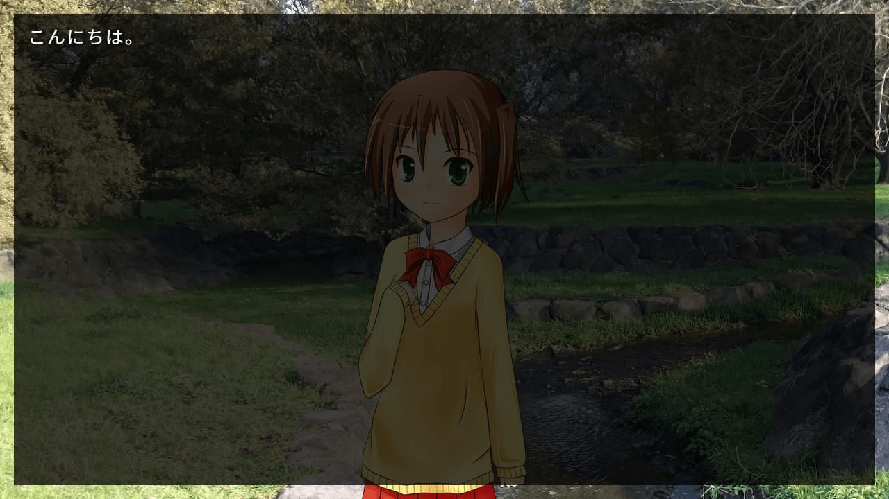
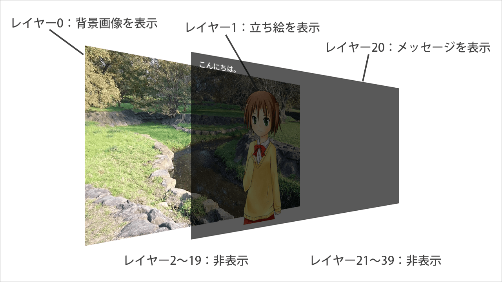

# レイヤーとページ

## レイヤーの基礎

Ponkan3の画面表示はすべて、重ね合わせたレイヤーで表示されています。
Photoshopなどの画像編集ソフトのレイヤーと同じようなものです。

以下のスクリプトと画面を例に説明します。

```plain
# ゲーム開始スクリプト
;call file: "script/init_system.pon"

;loadimage lay: 0, file: "image/sample-bg.jpg", visible: true
;loadimage lay: 1, file: "image/chara.png", visible: true, x: 515, y: 100
こんにちは。
```



この画面は、

- 背景の画像
- キャラクターの画像
- メッセージ

の3つで構成されています。これらのレイヤー構成は、次のようになっています。



レイヤーは初期状態で40枚用意されており、0～39の番号で管理されています。
若い番号のレイヤーほど後ろに描画され、大きい番号のレイヤーほど手前に描画されます。

初期状態ではレイヤー20がメッセージレイヤーに設定されているので、ここにメッセージが出力されます。

画像のレイヤーで描画するのかは、コマンドのパラメータの`lay`で設定しています。
また、メッセージレイヤーを除くすべてのレイヤーは最初は非表示状態になっているので、
`image`コマンドの`visible`パラメータでレイヤーを表示状態にしています。

<div class="note">
レイヤーの表示・非表示切替は<code>image</code>コマンドでも可能ですが、通常は<code>layopt</code>コマンドで行います。<br>
<code>layopt</code>コマンドは、レイヤーの座標、サイズ、表示などの設定を行うコマンドです。
</div>

## ページ

Ponkan3では、上記で説明したレイヤー構成が2組あり、それぞれ表ページ・裏ページと呼びます。

表ページは画面に表示されている方のページです。通常、コマンドで操作する対象は表ページになります。

裏ページは画面に表示されません。コマンドで操作するためには、パラメータで`page: "back"`と明示的に指定する必要があります。

裏ページは画面に表示されないのになぜ存在するのかというと、これはトランジション（画面切り替え）のためです。
トランジションはページと裏ページを入れ替えることで行うため、その時の一時的な場所として裏ページが利用されます。

トランジションについては別章で説明します。

## 吉里吉里2/KAG3との差異

Ponkan3のレイヤーと吉里吉里2/KAG3のレイヤでは色々な違いがありますが、
大きな違いは以下の2点です。

- Ponkan3では、すべてのレイヤーで画像表示とメッセージ表示の両方が実行できます。
    - KAG3では背景レイヤ、前景レイヤ、メッセージレイヤと3種類のレイヤがありましたが、Ponkan3では区別はありません。
- Ponkan3では、レイヤーの表示順序は固定です。
    - KAG3では`index`属性でレイヤの重ね合わせ順序を変更できましたが、Ponkan3では変更できません。
