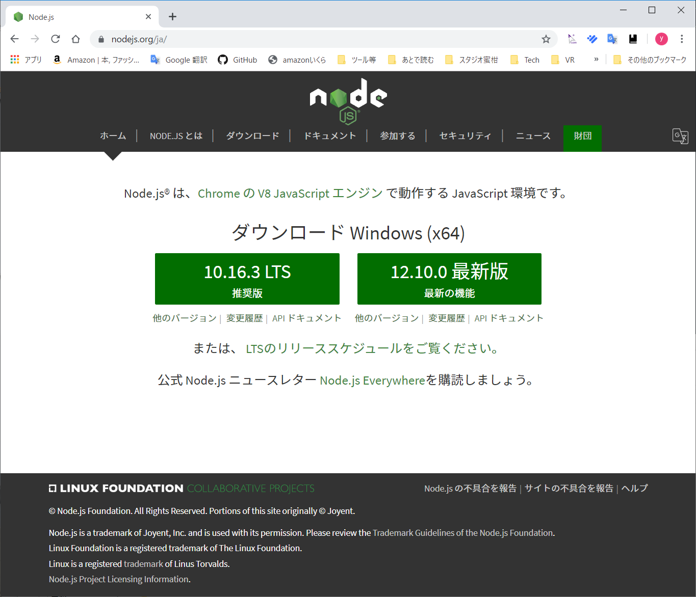
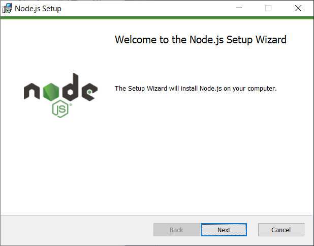
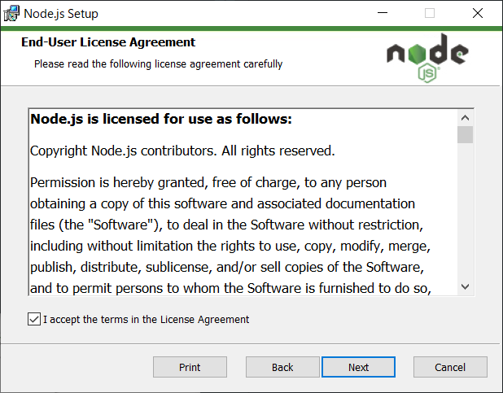
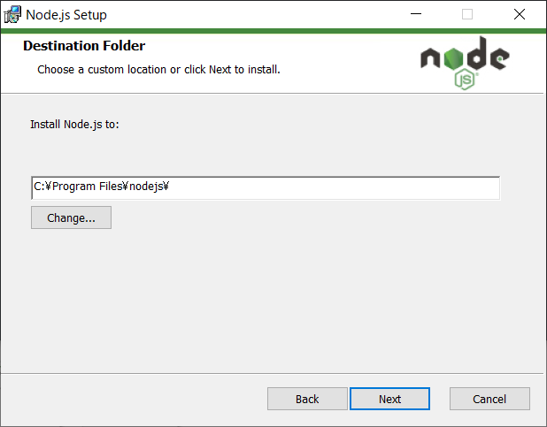
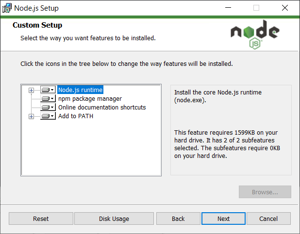
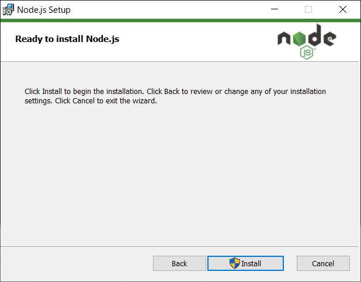
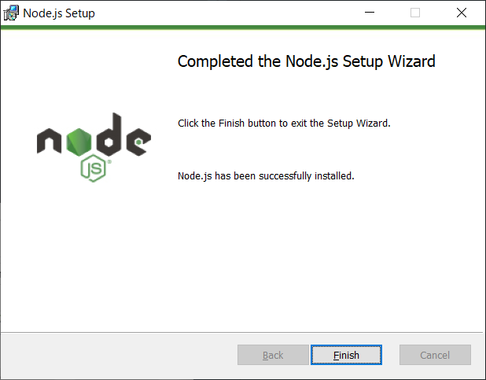

# Node.js導入（Windows）

注意：今後のNode.jsのバージョンアップで変更が入る可能性があります。
あくまで参考程度にして下さい。

[Node.js 日本語サイト](https://nodejs.org/ja/) からダウンロードします。
今回は左側のLTS版をいダウンロードします。



ダウンロードしてきたインストーラーを起動してください。



Nextをクリックして次へ進みます。



ライセンスに同意して、Nextをクリックします。



インストール先を指定します。とくに理由がなければデフォルト値のままにします。



インストールするモジュールを選択します。基本的にはそのままにしておきます。



Installをクリックすると、実行するかどうかWindowsが確認してきます。「はい」をクリックするとインストールが始まります。



インストールが完了したら、Finishで終了します。

インストールができているかどうか確認します。
コマンドプロンプトまたはWindows PowerShellを開き、次のコマンドを実行します。

```bat
> node --version
v10.16.3
```

Node.jsのバージョンが表示されれば、インストール完了です。
